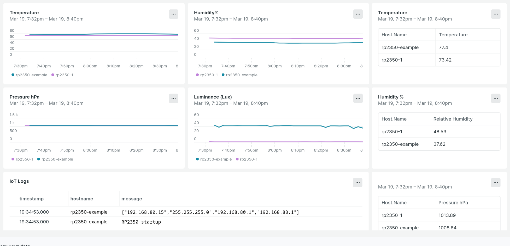
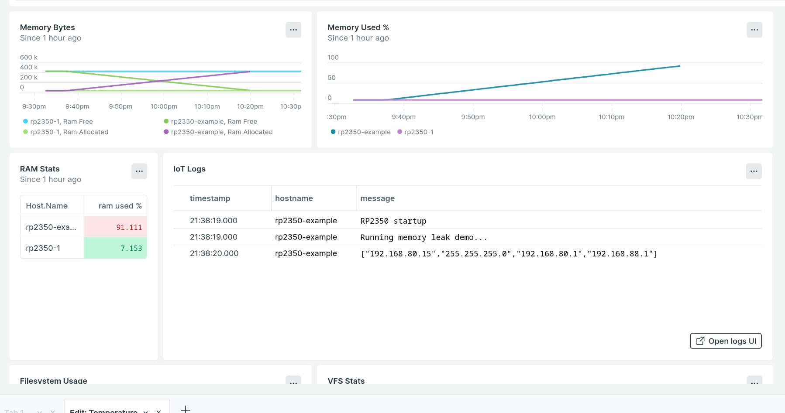

# RP2350_Sensor_NR

## Purpose

This project is an example of an embedded IoT device being instrumented with New Relic

It contains an RP2350 microcontroller with firmware in micropython, a BME280 and BH1750 to send environmental data.
There is a lightweight agent to send the environmental data as well as resource utilization about the device itself.

A device similar to this could be used to measure the effectiveness of an automated building HVAC control system.  
Temperature, and Humidity could determine if any rooms are out of range.  Pressure could be use to determine if there is a problem with a 
make up air system or positive/negative room pressure isolation systems.

Dashboards could look something like this:

## Software installation
1. Install Micropython image on RP2350 *for this step only you will need a compuer that doesn't block usb storage devices*
2. Download the [image](https://micropython.org/download/RPI_PICO2_W/) for the Pico 2 W 
3Plug the device in, and drag the .uf2 file in
4. Install [Thonny](https://thonny.org/)
5. Switch the intrepreter in the bottom right to the micropython on the microcontroller
6. In Thonny's file interface, upload .py files in the root of the porject along with the entire lib directory

## Software configuration
*Before beginning make sure you have a New Relic account set up*
*you can get [one](https://newrelic.com/pricing/free-tier) for free*

1. Generate and copy a NR License aka ingest [key](https://one.newrelic.com/launcher/api-keys-ui.api-keys-launcher?_gl=1*1ubudw0*_gcl_au*ODM1MTQzNjA0LjE3NDE0NTMwNTM.*_ga*ODU3NjgwMDEyLjE3NDE0NTMwNTM.*_ga_R5EF3MCG7B*MTc0MjQzMTkyOS43LjEuMTc0MjQzMTk2OC4yMS4xLjExMDY0NDY0NDU.)
2. Open the credentials.py file on the device in Thonny.  Add your wifi credentials and the license key you copied
3. Open environment.py and change the hostname, appname, and if necessary your region for WIFI frequency compliance.
4. Reset the board, or click stop, then run main.py in Thonny

## Configure Newrelic
1. Upload .json file from dashboards using these [directions](https://docs.newrelic.com/docs/query-your-data/explore-query-data/dashboards/dashboards-charts-import-export-data/)
2. Create your own alert [conditions](https://docs.newrelic.com/docs/tutorial-create-alerts/create-an-alert/)

## Running the device
Once the device software is configured, it can run independently within range of WIFI.
There is no need to keep it hooked up to a computer.  A simple 5v micro usb plug will do just fine.  When powered on
the device will enter its default mode of reporting environmental and system metrics.  
The oled will display a summary.  The reset button will reboot the device.

*Memory leak demo*

The device also have a memory leak mode.  Holding down on SW3 while the
device starts will put the device in memory leak mode.  This can be accomplished by holding down SW3
and pressing the reset button or holding down on SW3 while plugging it in.

The device will indicate memory leak mode has been entered but illuminating
the red and yellow (D1 and D2) LED's.  The device will leak memory for about 45 minutes or so
until crashing.  This will **not** harm the device.  In NewRelic you should be
able to see memory utilization climb until the device can no longer allocate
memory and crash.  It will stop reporting metrics:

You may or may not get an error message similar to the above on the OLED, as crashes are unpredictable.
After crashing, a reset is needed either by hitting the reset button or unplugging and plugging the device back in.

